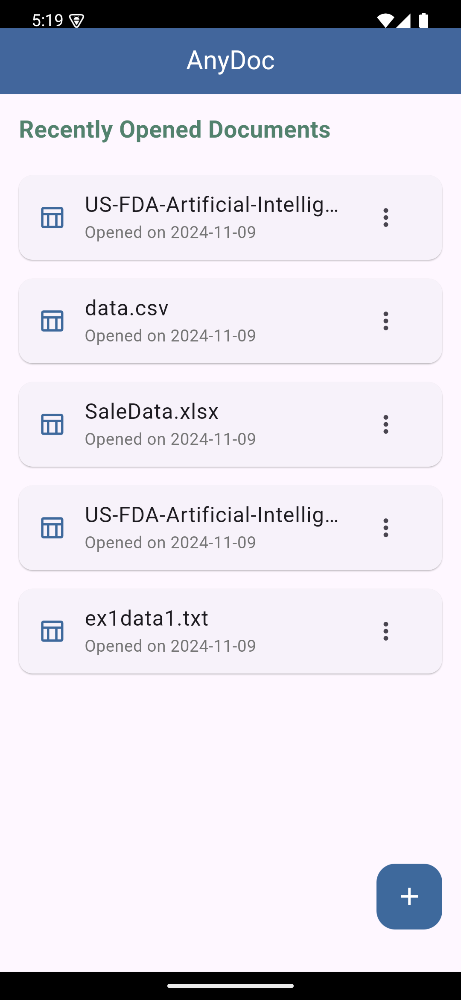
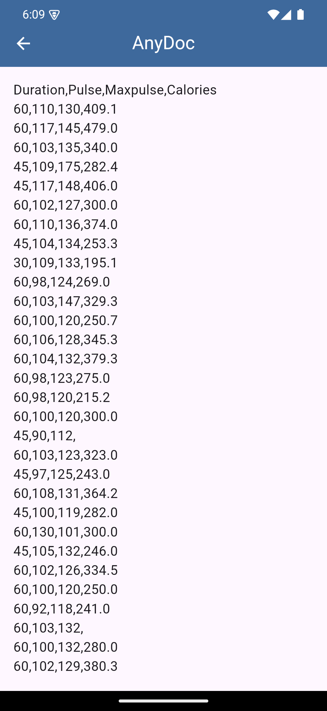
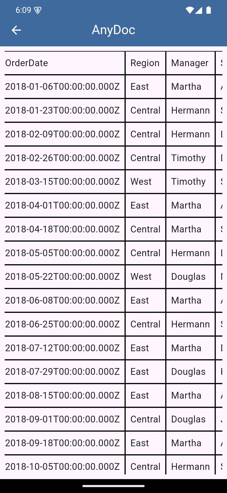

# AnyDoc

AnyDoc is a simple Flutter application designed to open and view various document types such as PDF, Excel (XLSX), CSV, and TXT files. This app allows users to easily open and view documents directly on their devices with a user-friendly interface.

## Features

- **File Picker**: Users can pick files from their device storage using the file picker.
- **Supported File Types**:
  - PDF
  - Excel (XLSX)
  - CSV
  - TXT
- **File Viewing**: Once a file is selected, the app opens the file using the default application associated with that file type.

## Screenshots
<p>    </p>

## Getting Started

To get started with AnyDoc, follow these steps:

### Prerequisites

1. Install Flutter on your machine. You can find instructions on how to set up Flutter on your system [here](https://flutter.dev/docs/get-started/install).
2. Ensure you have an Android/iOS emulator or a physical device ready to test the app.

### Installation

1. Clone this repository to your local machine:

    ```bash
    git clone https://github.com/santoshvandari/AnyDoc.git
    cd AnyDoc
    ```

2. Install dependencies:

    ```bash
    flutter pub get
    ```

3. Run the application on an emulator or connected device:

    ```bash
    flutter run
    ```


## Installation
To install the app on your Android device:
1. Download the latest APK from the [Releases](https://github.com/santoshvandari/AnyDoc/releases) section.
2. Transfer the APK to your phone and install it.


## Usage

1. When you open the app, you will see a button labeled "Pick and Open File".
2. Tap the button to open the file picker. You can choose a PDF, Excel (XLSX), CSV, or TXT file from your device's storage.
3. Once a file is selected, the app will attempt to open it with the appropriate viewer on your device.

## Supported File Types

Currently, the application supports the following file types:

- **PDF**: View PDF documents.
- **Excel (XLSX)**: Open and view Excel files.
- **CSV**: View CSV files in a simple format.
- **TXT**: Open and read plain text files.


## Contributing
We welcome contributions! Feel free to submit a pull request or open an issue if you find bugs or want to add new features.

## License
This project is licensed under the MIT License. See the [LICENSE](LICENSE) file for details.

## Contact
For any inquiries or support, please reach out at:
- **GitHub**: [@santoshvandari](https://github.com/santoshvandari)


Thank you for using AnyDoc! Enjoy Using effortlessly!
